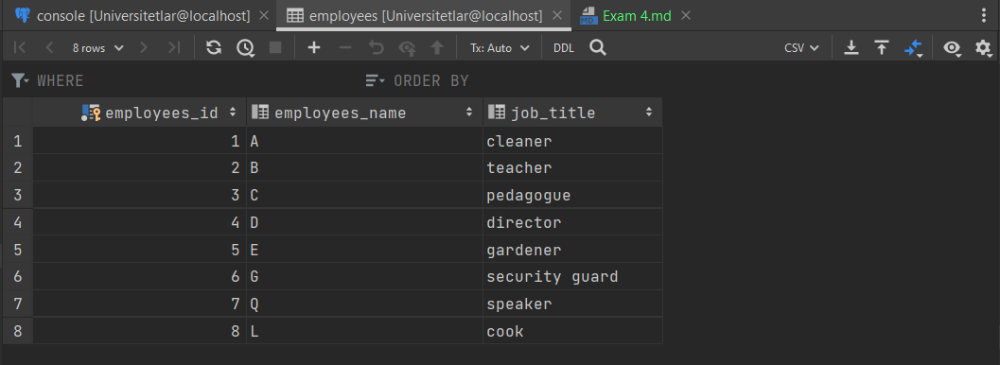
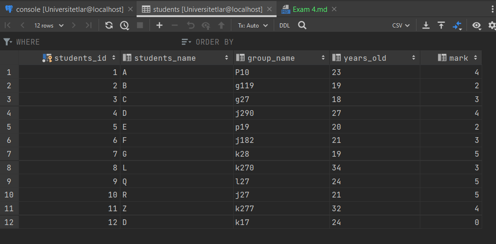
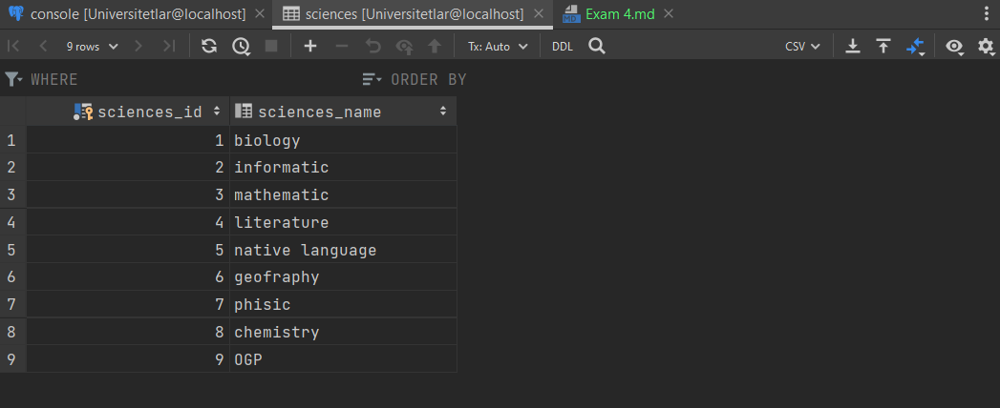
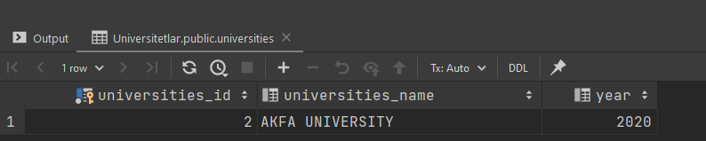
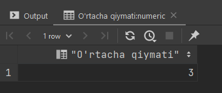
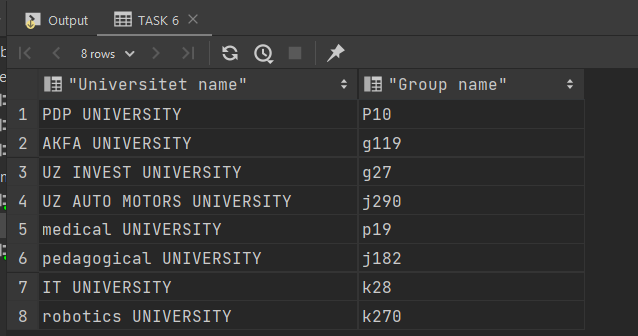
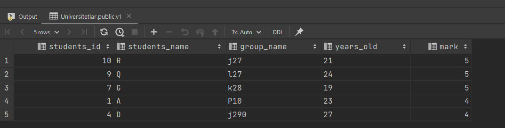

**1 - Univertitetlar boshqaruv tizimi uchun malumotlar bazasini yarating**
```sql
create table universities(
    universities_id serial primary key,
    universities_name varchar(255),
    year integer
);

create table departments(
    table_id serial primary key,
    departments_name varchar(255)
);

create table faculties(
    faculties_id serial primary key,
    faculties_name varchar(255),
    year_of_study integer
);

create table employees(
    employees_id serial primary key,
    employees_name varchar(400),
    job_title varchar(400)
);

create table students(
    students_id serial primary key,
    students_name varchar(1000),
    group_name varchar(100),
    years_old varchar(1000),
    mark integer
);

create table groups(
    groups_id serial primary key,
    groups_name varchar(255)
);

create table sciences(
    sciences_id serial primary key,
    sciences_name varchar(50)
)
```

**RESULT**


**2 - Har bitta jadvalga kamida 10 tadan malunot kiriting**

```sql
insert into universities(universities_id, universities_name, year)
values (1, 'PDP UNIVERSITY', 2022);

insert into universities(universities_id, universities_name, year)
values (2, 'AKFA UNIVERSITY', 2020);

insert into universities(universities_id, universities_name, year)
values (3, 'UZ INVEST UNIVERSITY', 2020);

insert into universities(universities_id, universities_name, year)
values (4, 'UZ AUTO MOTORS UNIVERSITY', 2012);

insert into universities(universities_id, universities_name, year)
values (5, 'medical UNIVERSITY', 2001);

insert into universities(universities_id, universities_name, year)
values (6, 'pedagogical UNIVERSITY', 2026);

insert into universities(universities_id, universities_name, year)
values (7, 'IT UNIVERSITY', 2022);

insert into universities(universities_id, universities_name, year)
values (8, 'robotics UNIVERSITY', 2023);
```

**RESULT**


```sql
insert into departments(table_id, departments_name)
values (1, 'robotics');

insert into departments(table_id, departments_name)
values (2, 'IT');

insert into departments(table_id, departments_name)
values (3, 'pedagogical');

insert into departments(table_id, departments_name)
values (4, 'medical');

insert into departments(table_id, departments_name)
values (5, 'laptops');

insert into departments(table_id, departments_name)
values (6, 'dentistry');

insert into departments(table_id, departments_name)
values (7, 'pc');

insert into departments(table_id, departments_name)
values (8, 'economist');
```

**RESULT**


```sql
insert into faculties(faculties_id, faculties_name, year_of_study)
values (1, 'philological', 5);

insert into faculties(faculties_id, faculties_name, year_of_study)
values (2, 'philosophical', 3);

insert into faculties(faculties_id, faculties_name, year_of_study)
values (3, 'journalism', 4);

insert into faculties(faculties_id, faculties_name, year_of_study)
values (4, 'psychology', 6);

insert into faculties(faculties_id, faculties_name, year_of_study)
values (5, 'sociology', 2);

insert into faculties(faculties_id, faculties_name, year_of_study)
values (6, 'historical', 3);

insert into faculties(faculties_id, faculties_name, year_of_study)
values (7, 'legal', 5);

insert into faculties(faculties_id, faculties_name, year_of_study)
values (8, 'economic', 6);
```

**RESULT**


```sql
insert into employees(employees_id, employees_name, job_title)
values (1, 'A', 'cleaner');

insert into employees(employees_id, employees_name, job_title)
values (2, 'B', 'teacher');

insert into employees(employees_id, employees_name, job_title)
values (3, 'C', 'pedagogue');

insert into employees(employees_id, employees_name, job_title)
values (4, 'D', 'director');

insert into employees(employees_id, employees_name, job_title)
values (5, 'E', 'gardener');

insert into employees(employees_id, employees_name, job_title)
values (6, 'F', 'security guard');

insert into employees(employees_id, employees_name, job_title)
values (6, 'G', 'security guard');

insert into employees(employees_id, employees_name, job_title)
values (7, 'Q', 'speaker');

insert into employees(employees_id, employees_name, job_title)
values (8, 'L', 'cook');
```


**RESULT**




```sql
insert into students(students_name, years_old, mark, group_name)
values ('A', 23, 4, 'P10');

insert into students(students_name, years_old, mark, group_name)
values ('B', 19, 2, 'g119');

insert into students(students_name, years_old, mark, group_name)
values ('C', 18, 3, 'g27');

insert into students(students_name, years_old, mark, group_name)
values ('D', 27, 4, 'j290');

insert into students(students_name, years_old, mark, group_name)
values ('E', 20, 2, 'p19');

insert into students(students_name, years_old, mark, group_name)
values ('F', 21, 3, 'j182');

insert into students(students_name, years_old, mark, group_name)
values ('G', 19, 5, 'k28');

insert into students(students_name, years_old, mark, group_name)
values ('L', 34, 3, 'k270');

insert into students(students_name, years_old, mark, group_name)
values ('Q', 24, 5, 'l27');

insert into students(students_name, years_old, mark, group_name)
values ('R', 21, 5, 'j27');

insert into students(students_name, years_old, mark, group_name)
values ('Z', 32, 4, 'k277');

insert into students(students_name, years_old, mark, group_name)
values ('D', 24, 0, 'k17');

```

**RESULT**




```sql
insert into groups(groups_name, number_of_students)
values ('gr-name1', 23);

insert into groups(groups_name, number_of_students)
values ('P10', 12);

insert into groups(groups_name, number_of_students)
values ('P11', 23);

insert into groups(groups_name, number_of_students)
values ('P5', 17);

insert into groups(groups_name, number_of_students)
values ('g118', 24);

insert into groups(groups_name, number_of_students)
values ('G119', 23);

insert into groups(groups_name, number_of_students)
values ('g13', 24);

insert into groups(groups_name, number_of_students)
values ('v23', 24);

insert into groups(groups_name, number_of_students)
values ('v90', 18);

insert into groups(groups_name, number_of_students)
values ('g16', 30);

insert into groups(groups_name, number_of_students)
values ('J93', 12);
```


**RESULT**


```sql
insert into sciences(sciences_name)
values ('biology');

insert into sciences(sciences_name)
values ('informatic');

insert into sciences(sciences_name)
values ('mathematic');

insert into sciences(sciences_name)
values ('literature');

insert into sciences(sciences_name)
values ('native language');

insert into sciences(sciences_name)
values ('geofraphy');

insert into sciences(sciences_name)
values ('phisic');

insert into sciences(sciences_name)
values ('chemistry');

insert into sciences(sciences_name)
values ('OGP');
```

**RESULT**




**3 - Universtitetlar jadvalifan nomi 'A' harifli bilan boshlanadiganlari bolsa qaytaring**

```sql 
select * from universities
where universities_name like 'A%'
```

**RESULT**



**4 - Talabalarni jadvalidan bahosi eng yuqori bolgan 5 ta talabani qaytaring**

```sql
select * from students
order by mark desc
limit 5
```

**RESULT**


**5 - Har bitta guruhda nechta talabalar borligini va talabalarning ortacha bahosi qaytaring**


```sql
select group_name, count(group_name)
from students
group by group_name
order by group_name;
```

**RESULT**


```sql
select sum(mark) / count(mark) as "O'rtacha qiymati"
from students;
```

**RESULT**




**6 - Talabalar jadvali malumotlarini universtitet va guruh nomlari bilan birga chiqaring**

```sql
select universities_name as "Universitet name", students.group_name as "Group name"
from students
inner join universities
on students.students_id = universities.universities_id;
```

**RESULT**




**7 - 4 va 6 masalalar uchum viewlar yarating**

```sql
create or replace view v1 as
select *
from students
order by mark desc
limit 5;

create or replace view v2 as
select universities_name   as "Universitet name",
       students.group_name as "Group name"
from students
         inner join universities
                    on students.students_id = universities.universities_id;

select *
from v1;

select *
from v2
```

**RESULT**




**8 - trigger **

**toliq emas **

```sql
create trigger trigger_student
    after update
    on students
    for each row
    execute procedure;


create or replace function trigger_student()
returns trigger
language plpgsql
as
$$
BEGIN
if old <> new then
    insert into logs (name, detail, old_data, new_data, table_name)
    values (
             'Updated.', OLD::json, NEW::json, 'students');
end if;
return
end;
$$


create trigger trigger_niversities
    after update
    on universities
    for each row
    execute procedure;


create or replace function trigger_niversities()
returns trigger
language plpgsql
as
$$
BEGIN
if old <> new then
    insert into logs (name, detail, old_data, new_data, table_name)
    values (
             'Updated.', OLD::json, NEW::json, 'universities');
end if;
return
end;
$$

```