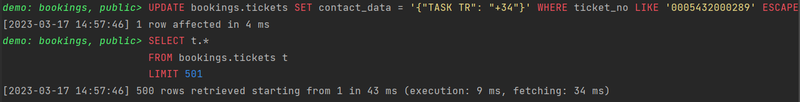
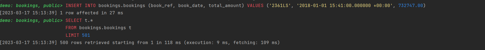

**LESSON**

```sql
create or replace function tickets_update_data()
    returns trigger
    language plpgsql
as
$$
begin
    if tg_op = 'UPDATE' then
        insert into logs(detail, old_data, new_data, table_name)
        values ('Update.', row_to_json(old), row_to_json(new), 'tickets');
        return new;
    elseif tg_op = 'DELETE' then
        insert into logs(detail, old_data, table_name)
        values ('DELETED', row_to_json(OLD), 'tickets');
        return old;
    end if;
end;

$$
```

**RESULT**




```sql
create or replace function  bookings_new()
    returns trigger
    language plpgsql
as
    $$
begin
    if tg_op = 'NEW' then
        insert into logs(detail, new_data, table_name)
        values ('New.', row_to_json(new), 'bookings');
        return new;
    end if;
end;

$$
    
```

**RESULT**



