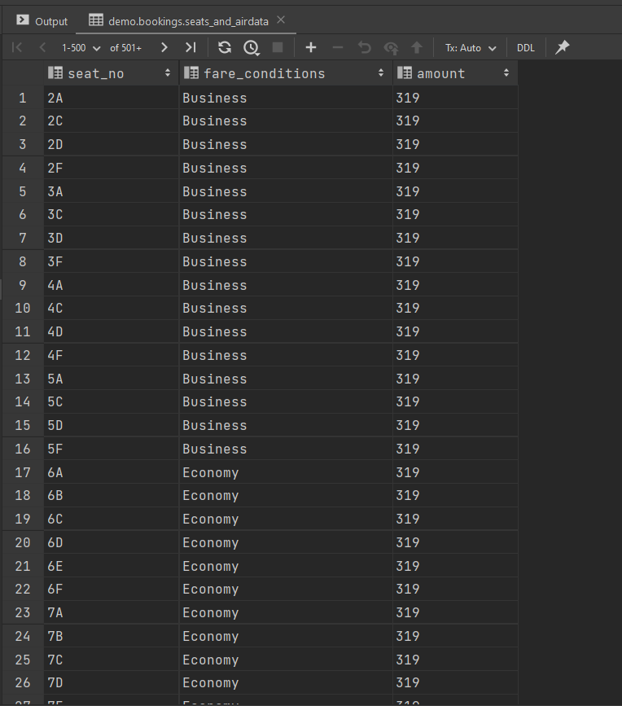
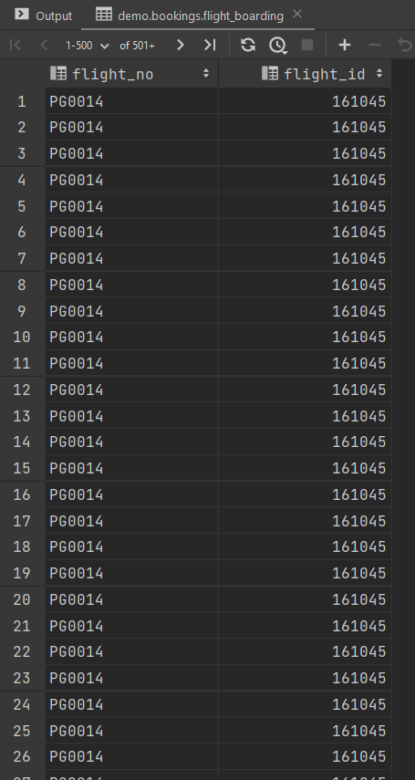
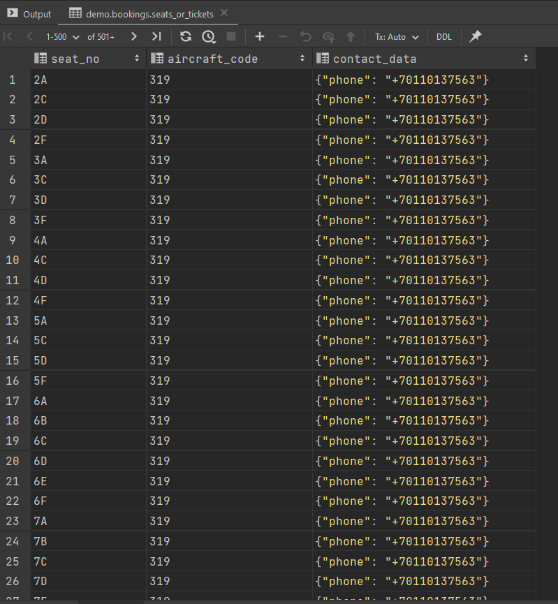

**LESSONS**

```sql
create or replace view seats_and_airdata as
select seat_no,
       f.fare_conditions,
       tf.aircraft_code
       amount
from seats f
            inner join aircrafts_data tf on tf.aircraft_code = f.aircraft_code;

select * from seats_and_airdata
```
**RESULT**




```sql
create or replace view flight_boarding as
select flight_no,
       f.flight_id
from flights f
            inner join boarding_passes tf on f.flight_id = tf.flight_id;

select * from flight_boarding
```

**RESULT**




```sql
create or replace view seats_or_tickets as
select seat_no,
       f.aircraft_code,
       tf.contact_data

from seats f
            inner join tickets tf on tf.contact_data = tf.contact_data;

select * from seats_or_tickets
```

**RESULT**

