SELECT PART1

1. Categories jadval barcha ustun ma’lumotlarini bilan qaytaring
   
   ```sql
   select * from categories
   ```
   **Result:**
   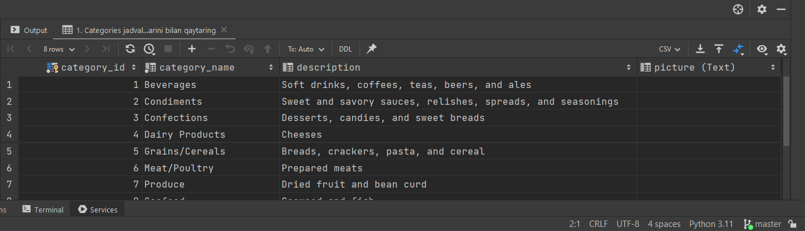


2. Categories jadval category_name va description ustun ma’lumotlarini qaytaring.
    ```sql
    select category_name, description from categories
    ```
    **Result:**
   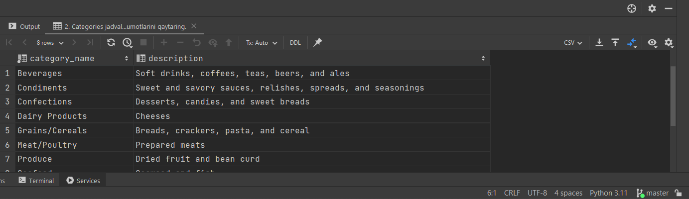


3. Categories jadval barcha ustun ma’lumotlari olishda ustun nomlarini o’zbekcha tarjimada
   ```sql
   select category_name as nomi, description as tavsifi, picture as rasm from categories
   ```
   **Result:**
   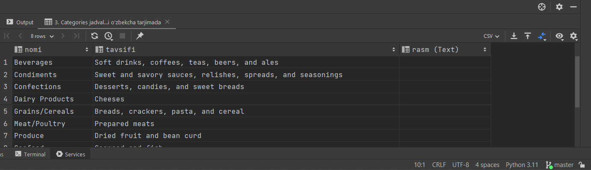


4. Categories jadvaldan kategoriya nomi ’Confections’ ga teng bo’lgan ma’lumotlarni qaytaring
   ```sql
   select * from categories
   where category_name='Confections'
   ```
   **Result:**
   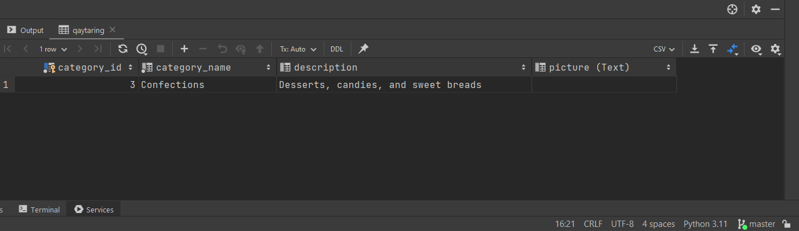


5. Categories jadvaldan kategoriya nomi ‘Produce’ yoki ‘Seafood’ bo’lgan ma’lumotlarni qaytaring.
    ```sql
    select * from categories
    where category_name='Seafood' or category_name='Produce'
    ```
    **Result:**
    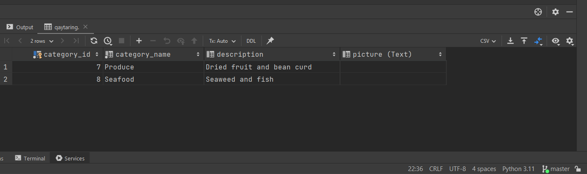


6. Categories jadvaldan quyida belgilangan ma’lumotlarni qaytaring
```sql
   select * from categories
   where category_name='Seafood' or category_name='Produce' or category_name='Meat/Poultry'
   ```
   **Result:**
   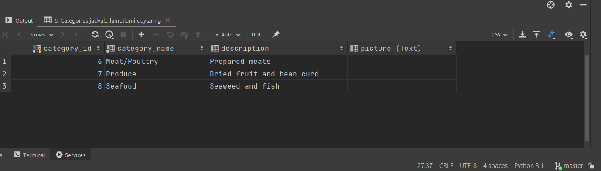


7. Categories jadvaldan ma’lumotlarni description alifbo bo’yicha Z-A tartibida chiqaring.
```sql
   select * from categories
   order by description desc
   ```
   **Result:**
   


8. Customers jadvalidan barcha ma’lumotlarni oling
```sql
   select * from customers
   ```
   **Result:**
   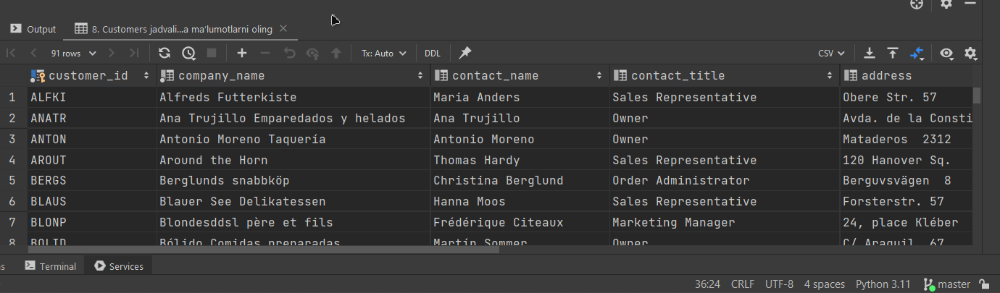


9. Customers jadvalida ustun nomlarini o’zbekcha holatda oling.
```sql
   select
   customer_id as Mijoz_idisi,
   company_name as Shirkat_nomi,
   contact_name as kontakt_nomi,
   contact_title as kontakt_sarlavhasi,
   address as manzil,
   city as shahar,
   region as mintaqa,
   postal_code as Pochta_kodi,
   country as mamlakat,
   phone as telefon,
   fax as faks
   from customers
   ```
   **Result:**
   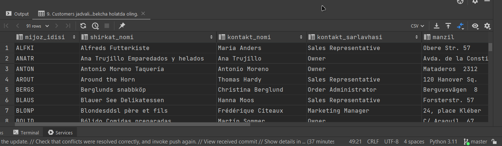


10. Customers jadvalidan contact_title ‘Owner’ bo’lgan ma’lumotlarni qaytaring.
```sql
   select * from customers
   where contact_title='Owner'
   ```
   **Result:**
   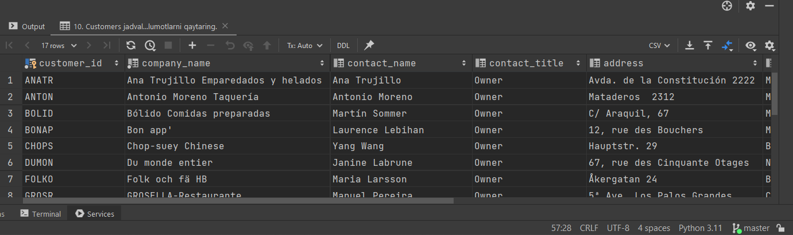


11. Customers jadvalidan city ‘London’ bo’lgan ma’lumotlarni qaytaring.
```sql
    select * from customers
    where city='London'
   ```
   **Result:**
   


12. Customers jadvalidan region ustun NULL bo’lgan ma’lumotlarni qaytaring.
```sql
    select contact_name, region from customers
    where region is null
   ```
   **Result:**
   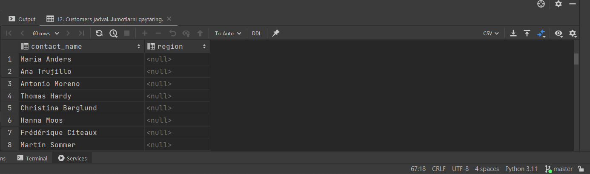


13. Customers jadvalidan region ustun NULL bo’lmagan ma’lumotlarni qaytaring.
```sql
    select contact_name, region from customers
    where region is not null
    ```
    **Result:**
    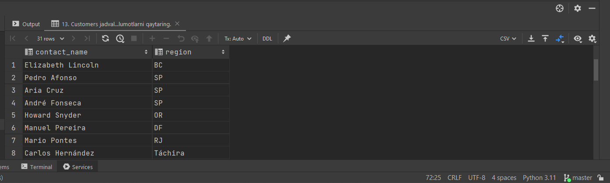


14. Customers jadvalidan country ustun Germany bo’lgan ma’lumotlarni qaytaring.
```sql
    select * from customers
    where country='Germany'
   ```
    **Result:**
   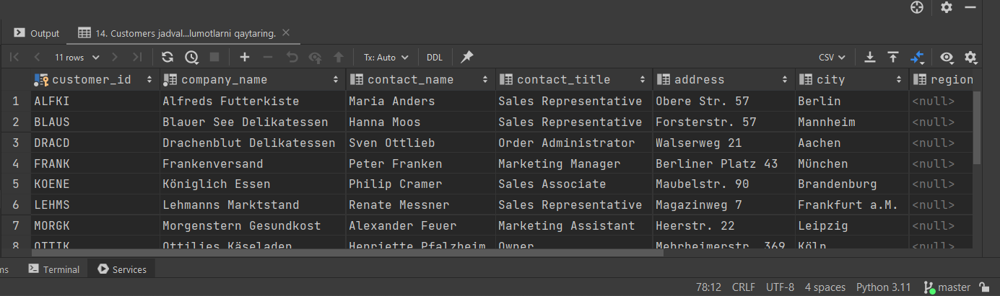


15. Customers jadvalidan country ustun Germany bo’lgan qatorlar sonini qaytaring.
   ```sql
    select count(county) from customers
    where country='Germany'
   ```
     **Result:**
    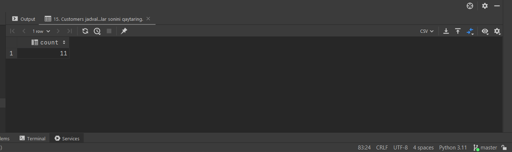


16. Customers jadvalidan fax ustun NULL bo’lmalgan ma’lumotlarni contact_name ustun alifbo tartiba tartiblab qaytaring.
  
    ```sql
    select fax, contact_name from customers
    where fax is not null 
    order by contact_name asc
    ```
    **Result:**
    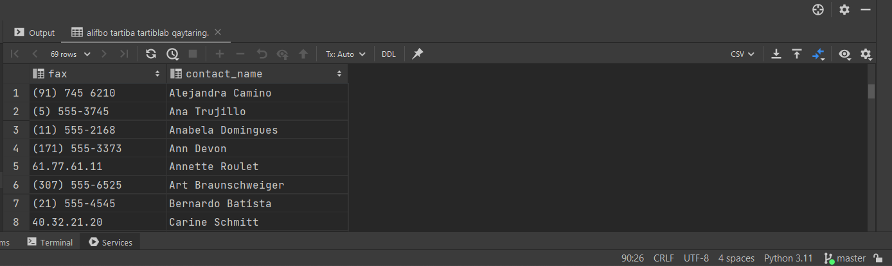


17. Employees jadvaldan barcha ma’lumotlarni qaytaring
    ```sql
    select * from employees
    ```
    **Result:**
    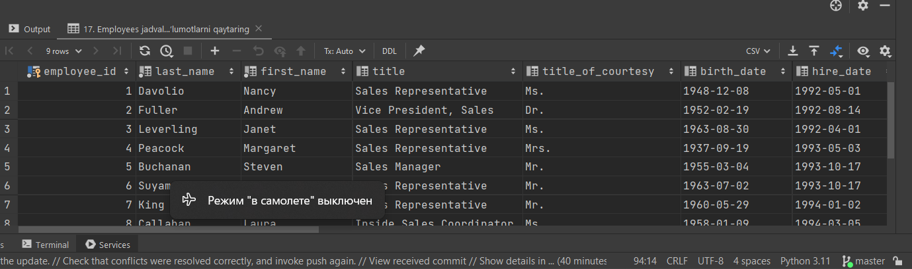


18. Employees jadval ustun nomlarini o’zbekcha qaytaring.
       ```sql
    select
    employee_id as xodim_identifikatori
    last_name as Ism,
    first_name as Familiya,
    title as sarlavha,
    title_of_courtesy as sarlavhasi,
    birth_date as tugilgan_kun_sanasi,
    hire_date as ishga_qabul_qilingan_sanasi,
    address as manzil,
    city as shahar,
    region as mintaqa,
    postal_code as Pochta_kodi,
    country as mamlakat,
    home_phone as Uy_telefoni,
    extension as kengaytma,
    photo as rasm,
    notes as eslatmalar,
    reports_to as hisobotlar,
    photo_path as rasm
    from employees
    ```
    
    **Result:**
    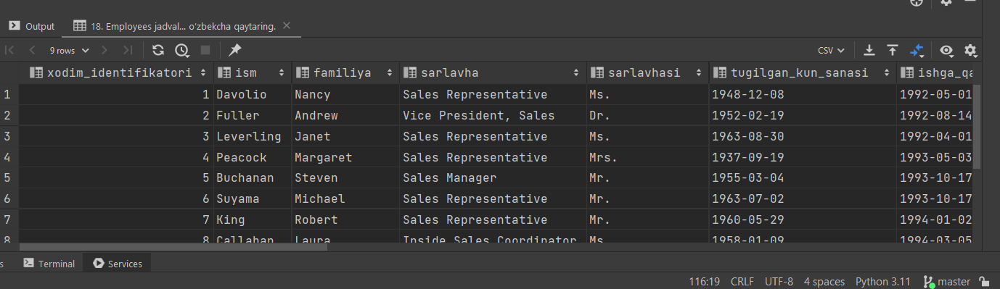


19. Employess jadvaldan title_of_courtest ‘Mr’ bo’lgan xodimlarni firts_name alifbo tartibida qaytaring
   ```sql
    select title_of_courtesy, first_name from employees
    where title_of_courtesy='Mr.'
    order by first_name asc
 ```
    **Result:**
    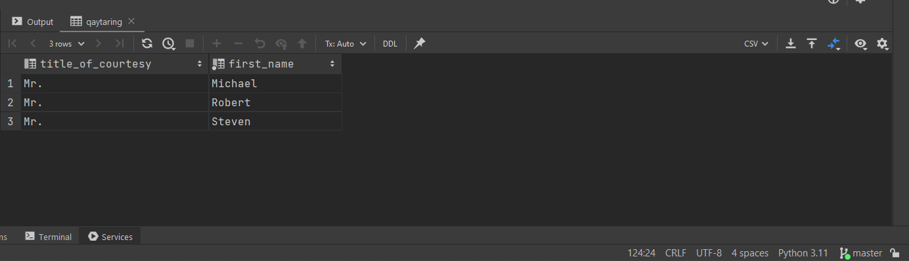


20. Employes jadvalda title ‘Sales Representative’ bo’lgan xodimlar sonini qaytaring
    ```sql
    select count(*) from employees
    where title='Sales Representative'
    ```
    **Result:**
    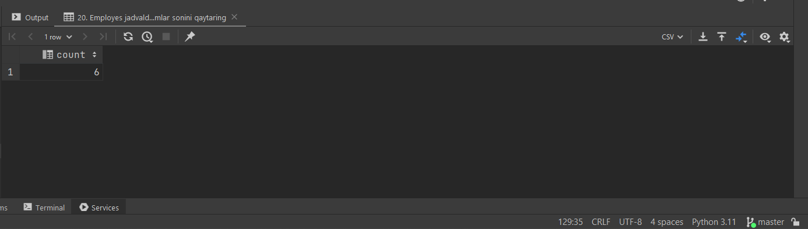


21. Employes jadvalda hire_date 1994-yilda bo’lgan ma’lumotlarni qaytaring.
   ```sql
    select hire_date from employees
    where hire_date between '1994-01-01' and '1994-12-31'
   ```
    **Result:**
    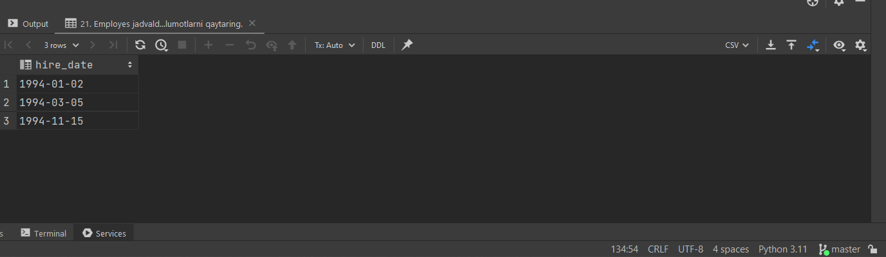


22. Employes jadvaldan region NULL bo’lmagan xodimlarni first_name, last_name, title, city,
      ```sql
    home_phone ma’lumotlarini first_name Z-A alifbo tartibida qaytaring.
    select region, first_name, last_name, title, city,home_phone from employees
    where region is not null
    order by first_name desc
    ```
    **Result:**
    


23. Orders jadvaldan customer_id ‘VINET’ bo’lgan buyurtmalarni qaytaring
      ```sql
    select order_id, ship_address, ship_name, customer_id from orders
    where customer_id='VINET'
    ```
    **Result:**
    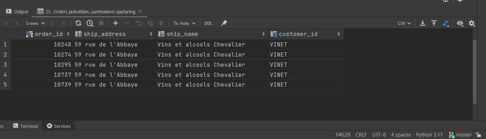


24. Orders jadvaldan order_date ustuni orqali 1996-yildagi ma’lumotlarni qaytaring.
         ```sql
    select * from orders
    where order_date between '1996-01-01' and '1996-12-31'
    and shipped_date between '1996-01-01' and '1996-12-31'
    and required_date between '1996-01-01' and '1996-12-31'
    ```
    **Result:**
    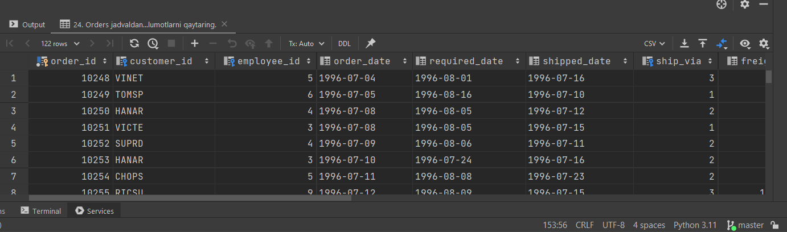


25. Orders jadvaldan ship_region ustun NULL bo’lmagan ma’lumotlarni qaytaring.
      ```sql
    select * from orders
    where ship_region is not null
    ```
    **Result:**
    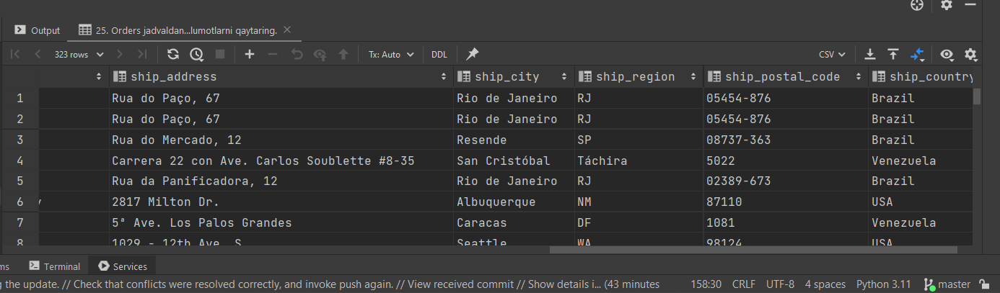


26. Orders jadvaldan order_id 10300 va 10400 orasida bo’lgan ma’lumotlarni qaytaring.
      ```sql
    select * from orders
    where order_id between '10300' and '10400'
    ```
    **Result:**
    


27. Order Details jadvaldan unit_price ustun umumiy qiymatini qaytaring.
      ```sql
    select sum(unit_price) from order_details
    ```
    **Result:**
    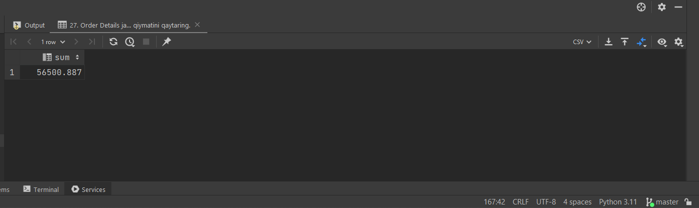
