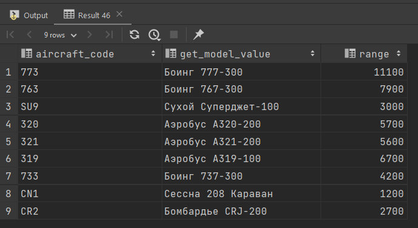
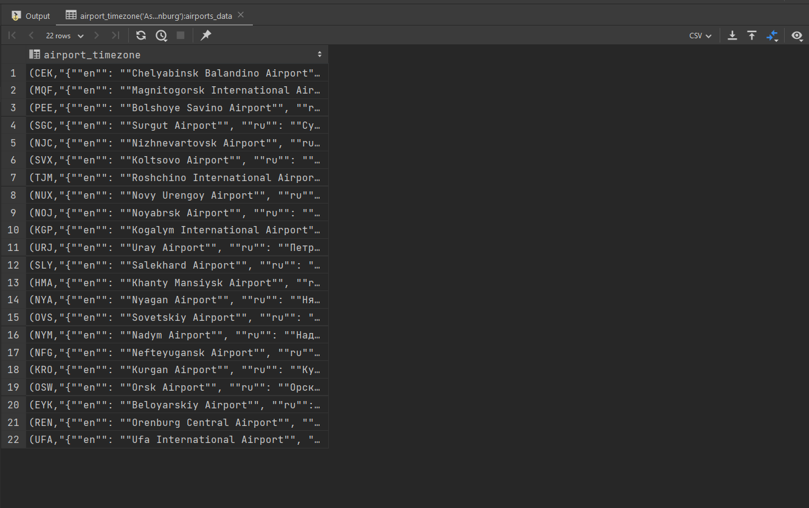
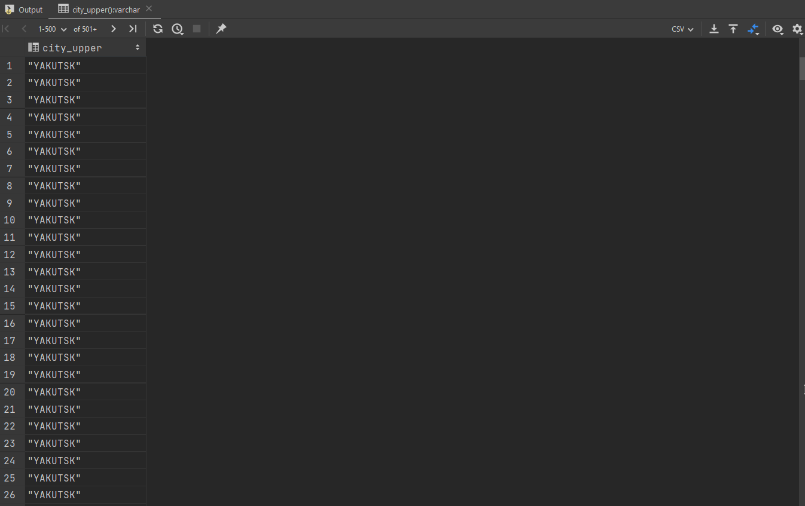

LESSONS
1. aircrafts_data table ma'lumotlarida model ustunda json turli en va ru uchun ma'lumotlar berilgan. en yoki ru kalit kiritilganda value sini qaytaradigan funksiya yarating.

```sql
create or replace function get_model_value(model jsonb, lang varchar)
    returns text
    language plpgsql
as
$$
begin
    return model ->> lang;
end;
$$;

select aircraft_code, get_model_value(model, lang := 'en'), range
from aircrafts_data;
```
**RESULT**




2. airports_data table ma'lumotlaridan foydalanib timezone kiritilganda ma'lumot qaytaradigan funksiya yarating.

```sql
create function airport_timezone(tmz varchar)
    returns airports_data
    language plpgsql
as
$$
begin
    select * from airports_data
    where timezone = tmz;
end;

$$;

select airport_timezone('Asia/Yekaterinburg');
```

**RESULT**




3. airports_data table ma'lumotlaridan foydalanib city ustunda json ma'lumot value larini katta harflarda funksiya yarating

```sql
create or replace function city()
    returns varchar
    language plpgsql
as
$$
declare
    result varchar := ' ';
begin
    select city['en']
    into result
    from airports_data;
    return upper(result);
end;
$$;

select city()
from bookings;
```

**RESULT**


